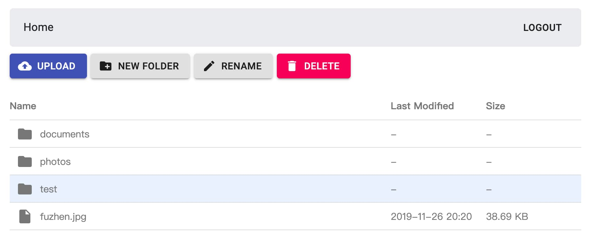

# Rclone Drive &middot; [](https://badge.fury.io/js/rclone-drive) [](https://opensource.org/licenses/MIT)

☁️Simple web cloud storage based on rclone, transform cloud storage (s3, google drive, one drive, dropbox) into own custom web-based storage

Take a demo: [https://demo.rclone.app](https://demo.rclone.app) 

password: `pass`

🏗️Under development



## 👻 Features

Thanks to rclone

1. ✅Support most of well-known cloud storage providers. (s3, google drive, dropbox, one drive ...[see full list](https://rclone.org/overview/))

2. 🔒Full encryption, you control your own files, privacy insured. [read more](https://rclone.org/crypt/)

3. 🗄️Easy to backup.

4. 🌍Get/Add your files from anywhere via a browser.

5. ⛔No ads.

6. 🤨One client to manage multiple drive backend.

7. 🚀Supper fast.

## 🛫 Getting started

### 1. Install

```
npm i -g rclone-drive
```

### 2. Install rclone

See [rclone official guide](https://rclone.org/downloads/), you can either download binary file or install globally.

### 3. Config rclone

See [rclone official guide](https://rclone.org/commands/rclone_config/), add a new remote using:

```
rclone config
```

### 4. Get params

#### --rclone

If you installed rclone globally, run this command to get rclone bin path:

```
which rclone
```

or if you downloaded rclone bin manually, that's the file `rclone`(`rclone.exe` in Windows)'s full path.

#### --rclone-config

Rclone config file path, by default, run this command to show:

```
rclone config file
```

#### --base-dir

The remote you just added to rclone, for example, you add a s3 remote named `mys3`, and want to use bucket `mybucket` as rclone-drive's base dir, just set `mys3:mybucket` (no slash in the end)

### 5. 🚀 Ready to go

```
rclone-drive --rclone="<somepath>" --rclone-config="<somepath>" --base-dir="mys3:mybucket"
```

then open [http://localhost:3000](http://localhost:3000) and enter the password shown in command line.

## ⚙️ Configuration

```
Usage: rclone-drive [options]

Options:
  -V, --version                       output the version number
  -P, --port [port]                   Server port (default: "3000")
  -a, --address [address]             Server port (default: "localhost")
  -p, --password [password]           Password to login, default is random string
  -s, --secret [secret]               Session secret, if not set, session will only be saved in memory
  -r, --rclone [rclone]               Rclone bin path, e.g "/usr/local/bin/rclone"
  -R, --rclone-config [rcloneConfig]  Rclone config file path, e.g "/Users/wangsijie/.config/rclone/rclone.conf"
  -d, --base-dir [baseDir]            Rclone base dir, e.g "s3:defaultbucket"
  -h, --help                          output usage information
```

## 🔧 TODO

- [ ] File sharing
- [ ] Directory/File move
- [ ] Docker support
- [ ] Upload progress
